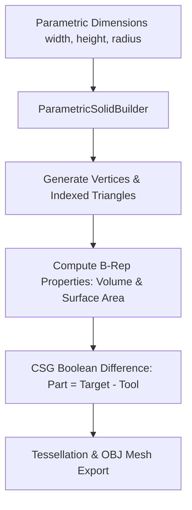

# 09 - Parametric 3D CAD B-Rep & CSG Solid Geometry Kernel (C++20)

## Executive Overview
A high-performance 3D geometric modeling kernel written in **modern C++20**. It implements **Boundary Representation (B-Rep)** and **Constructive Solid Geometry (CSG)** primitives (boxes, cylinders, spheres), signed tetrahedral volume integrals, analytical surface area calculations, and tessellated **Wavefront OBJ** export.

## Geometric Kernel Pipeline



### Source Tree
- **`src/cad_kernel.hpp`**: Mathematical vector structs (`Vec3`), triangle facets, mesh solid classes, and builder interfaces.
- **`src/cad_kernel.cpp`**: Implementation of vector cross products, signed tetrahedron volume integrals, and CSG primitives.
- **`src/main.cpp`**: Standalone executable demonstrating box/cylinder generation, boolean cuts, and OBJ export.
- **`CMakeLists.txt` & `Makefile`**: Native build manifests targeting C++20.
- **`runner/run.js`**: Numerical verification harness validating analytical vs computed volume.

## Mathematical Formulation: Signed Polyhedral Volume
By the Divergence Theorem, the exact volume of any closed 3D triangle mesh is computed as the sum of signed tetrahedra with respect to the origin:
$$V = \frac{1}{6} \sum_{i=1}^{N} \mathbf{v}_{0,i} \cdot (\mathbf{v}_{1,i} \times \mathbf{v}_{2,i})$$

## Native C++20 Build
```bash
make
./cad_kernel
# Or using CMake
cmake -B build && cmake --build build && ./build/cad_kernel
```

## Universal Verification
```bash
node runner/run.js
node orchestrator/run.js --project=09-cpp
```

## Senior Interview Q&A
- **Q: How does this kernel prevent floating-point catastrophic cancellation?** Vector normalizations check for epsilon thresholds (`length > 1e-9`). Volume integrals utilize signed tetrahedra which naturally cancel out interior overlaps.
- **Q: What modern C++20 features are used?** Utilizes `std::span`, designated initializers, `constexpr` mathematical constants, and strict value semantics with move constructors.\n